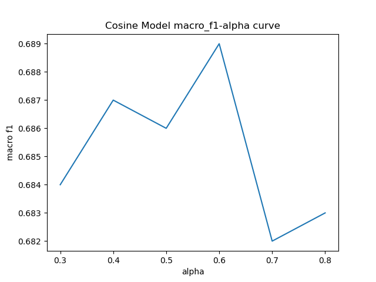

## 小样本数据分类baseline & 余弦语义相似度模型

#### 1. Baseline说明：

baseline原文地址：[DataFountain 交流讨论](https://discussion.datafountain.cn/articles/detail/2513)(BERT + last 4 pooling)

此处baseline对上述做了一定修改，包括：

- 取消了Dataloader预取，设置batch_size=4（因为在预取或者bs>4情况下本地带不动，bs更大可能效果更好）
- 修改了data_helper，数据先用模板整合成一个文段，再对文段用tokenizer

#### 2. 数据说明：

训练和测试数据存放在data/

- train.json：原始训练数据
- new_train_aug_trans：中英回译增强
- new_train_TF：基于TF-IDF词频做概率替换增强

#### 3. 运行方式

- **主要依赖包：** pytorch, transformers

- **BERT**：预训练模型[chinese-roberta-wwm-ext](https://huggingface.co/hfl/chinese-roberta-wwm-ext)。下载后chinese-roberta-wwm-ext文件夹放到与train.py、test.py同级目录

- **训练：**

  ```
  python ./train.py --model_name [MODEL_NAME] --train_file [TRAIN_FILE] --batch_size [BATCH_SIZE] --num_class [NUM_CLASS] --method [METHOD]
  ```

  - [MODEL_NAME]：模型名称，最终模型存储在`./save/[MODEL_NAME]/`下
  - [TRAIN_FILE]：训练集文件名称，可选项`train.json`、`new_train_aug_trans.json`、`new_train_TF.json`
  - [BATCH_SIZE]：批大小，由于本地带不动，默认设为4
  - [NUM_CLASS]：类别数量，默认设为32
  - [METHOD]：设置是使用Baseline模型还是余弦语义相似度模型，可选项`Basline`、`Cosine`，默认为`Cosine`
  - 其余参数见`config.py`

- **测试：**

  ```
  python ./test.py --model_name [MODEL_NAME] --num_class [NUM_CLASS] --method [METHOD]
  ```

#### 4. 测试结果：

各测试的详细结果见`result.txt`，这里放出简化结果：

| 模型                                   | 测试集上macro f1 |
| -------------------------------------- | ---------------- |
| Basline                                | 0.675            |
| Cosine   (数据title权重 $\alpha=0.4$)  | 0.687            |
| Cosine with TF   ($\alpha=0.4$)        | 0.661            |
| Cosine with aug_trans   ($\alpha=0.4$) | 0.687            |
| Cosine    ($\alpha=0.6$)               | **0.689**        |

TF效果差可能是因为没有对title做改变，而Cosine模型加大了title的权重；而TF和aug_trans在训练时感觉都过拟合了。

Cosine模型title权重$\alpha$和测试集上macro f1结果如下：



有点玄乎，不过大体上0.4-0.6的效果比较好